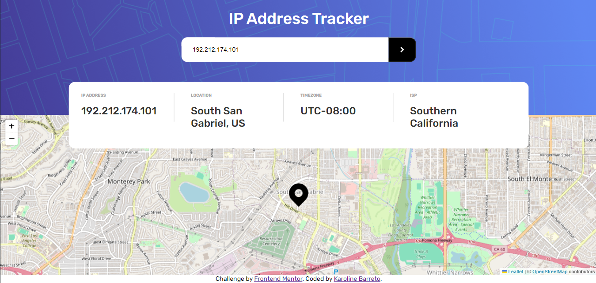

# Frontend Mentor - IP address tracker solution

This is a solution to the [IP address tracker challenge on Frontend Mentor](https://www.frontendmentor.io/challenges/ip-address-tracker-I8-0yYAH0).

## Overview

### Links

https://ip-address-tracker-karoldiasb.vercel.app/

#### Figma

https://www.figma.com/file/miJb5KbKAXapnJlQQQpJQc/ip-address-tracker?type=design&node-id=11%3A59&mode=design&t=1i50hoLvwFhMIx5U-1

### The challenge

Users should be able to:

- View the optimal layout for each page depending on their device's screen size
- See hover states for all interactive elements on the page
- See their own IP address on the map on the initial page load
- Search for any IP addresses or domains and see the key information and location

### Screenshots




## My process

### Built with

- [Next.js](https://nextjs.org/) - React framework
- [React](https://reactjs.org/) - JS library
- [useContext](https://react.dev/reference/react/useContext) - For state management
- [Styled Components](https://styled-components.com/) - For styles
- Theme structure usage with an abstraction of a BaseComponent to be reused by other components
   
## Getting Started

First, install dependencies:

```bash
yarn 
```

Then, run the development server:

```bash
yarn dev
```

Open [http://localhost:3000](http://localhost:3000) with your browser to see the result.
